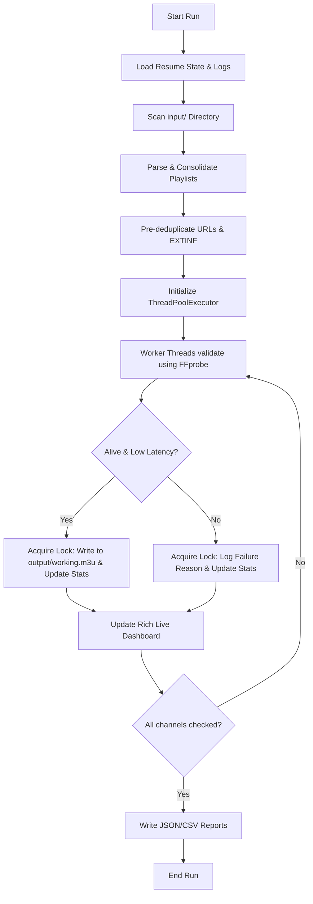

# ⚡ High-Performance IPTV Playlist Cleaner & Validator

A production-quality, multi-threaded command-line utility built in Python 3. It aggregates multiple IPTV playlist files (`.m3u` or `.m3u8`) from an input directory, checks connection validity and stream formats using `FFprobe`, automatically deduplicates streams, and writes a single working, responsive playlist into the output directory.

Optimized to process massive playlists containing **10,000 to 100,000+ channels** efficiently while maintaining a low memory footprint.

---

## 🚀 Key Features

*   **📂 Multi-Playlist Directory Aggregation**: Scans and parses all `.m3u` and `.m3u8` playlists in the `input/` folder, sorting and consolidating them deterministically.
*   **🛠️ True Stream Verification**: Invokes `FFprobe` to open the stream and verifies that at least one valid audio or video stream exists, instead of relying strictly on HTTP status codes (which can redirect to placeholders or login pages).
*   **⏱️ Latency & Timeout Boundaries**: Measures the elapsed clock time from process launch until the stream is identified. Filters out slow streams (default limit is `<= 500 ms`). Validations timeout at 5 seconds by default to prevent hangs.
*   **🔄 Intelligent Deduplication**: Automatically detects and drops duplicate URLs, duplicate channel names, and duplicate raw EXTINF headers across all input playlists.
*   **⏸️ Resume Support**: Remembers all processed streams (both dead and alive). If the process crashes or is cancelled (Ctrl+C), it picks up right where it left off on the next run using `--resume`.
*   **📊 Premium Live Console Dashboard**: Uses the `rich` library to render a dynamic console display containing elapsed time, current validation target, validation speed (channels per second), ETA, progress percentage, and alive/dead counters.
*   **📈 Detailed Reports**: Generates detailed JSON and CSV summaries of the run stats and individual stream latency, status, and failure reasons.
*   **📝 Structured Logs**: Outputs clean, structured log files in `logs/` for alive streams, dead streams, and system errors.

---

## 🧠 How It Works (Architecture & Workflow)



1.  **Setup & Initialization**: The orchestrator parses options, checks for `ffprobe` in the system PATH, and creates directory targets.
2.  **State Resumption**: If `--resume` is enabled, the program reads `logs/resume.dat` to extract already validated URLs, and parses `output/working.m3u` to build a registry of written channel names and URLs.
3.  **Directory Aggregation**: Scans `input/` for all `.m3u` and `.m3u8` files, sorting them to guarantee a deterministic processing order. It merges all entries into a unified list.
4.  **Pre-deduplication**: Filters the aggregated queue to discard duplicate URLs or identical headers before validation, saving execution time.
5.  **Parallel Validation**: Runs streams through a `ThreadPoolExecutor`. Workers call `FFprobe` with a 1-second analysis limit (`-analyzeduration 1000000 -probesize 1000000`) to fetch metadata instantly.
6.  **Thread-Safe Writing**: When a stream passes, the worker locks access, appends it to `output/working.m3u`, updates the dashboard stats, and records the output to `logs/alive.log` and `logs/resume.dat`. If a stream fails, it logs to `logs/dead.log`.
7.  **Dashboard & Reports**: The console updates 4 times per second with statistics. Upon completion, a JSON/CSV report is compiled detailing validation results.

---

## 🛠️ System Requirements

*   **Python 3.12+**
*   **FFmpeg (`ffprobe`)** binary installed on system path.

On Debian/Ubuntu systems:
```bash
sudo apt update && sudo apt install ffmpeg
```

---

## 📦 Installation & Setup

1.  Clone or copy this repository.
2.  Run the directory and dependency installer:
```bash
# Create local virtual environment
python3 -m venv venv

# Activate venv
source venv/bin/activate

# Install package dependencies
pip install -r iptv_cleaner/requirements.txt
```

---

## 🏃 How to Run

Use the included launcher script `run.sh` from the workspace root (it automatically handles virtual environment activation):

### 🔹 Basic Run
Reads all files in `input/`, validates streams, and outputs a single working playlist to `output/working.m3u`:
```bash
./run.sh
```

### 🔹 Run with Custom Limits
Configure workers, latency thresholds, socket timeouts, and report generation:
```bash
./run.sh --workers 60 --timeout 4.0 --max-latency 450 --json-report --csv-report
```

### 🔹 Resuming a Previous Run
Picks up from the last checkpoint using logs:
```bash
./run.sh --resume
```

---

## ⚙️ CLI Parameters Reference

| Parameter | Argument | Default | Description |
| :--- | :--- | :--- | :--- |
| `input_file` | Positional | `input` | Path to the playlist file or directory of playlist files |
| `-o`, `--output` | `path` | `output/working.m3u`| Consolidated output playlist path |
| `-w`, `--workers` | `int` | `50` | Concurrent validation threads |
| `-t`, `--timeout` | `float` | `5.0` | Socket/Process timeout per stream (seconds) |
| `-l`, `--max-latency`| `float` | `500.0` | Maximum stream startup latency allowed (ms) |
| `-r`, `--resume` | Flag | `False` | Skip already processed URLs and load existing output |
| `-v`, `--verbose` | Flag | `False` | Enable verbose console outputs |
| `-a`, `--append` | Flag | `False` | Append streams to output file instead of overwriting |
| `--json-report` | `[path]` | `None` | Save a JSON run report (defaults to `report.json` if flag present) |
| `--csv-report` | `[path]` | `None` | Save a CSV run report (defaults to `report.csv` if flag present) |
| `--require-both` | Flag | `False` | Require both video and audio streams to pass validation |
| `--no-retry` | Flag | `False` | Disable retrying failed streams once before marking dead |

---

## 📝 Output Log Files

Logs are written to the `logs/` directory:
*   `logs/alive.log`: Record of all working channels.
*   `logs/dead.log`: Failures with corresponding FFprobe exits or connection issue reasons.
*   `logs/errors.log`: Application-level stack traces or unexpected validation exceptions.
*   `logs/resume.dat`: Checkpoint state file containing processed stream URLs (used for resumption).

---

## 📄 License

This project is licensed under the MIT License. See the [LICENSE](LICENSE) file for details.
